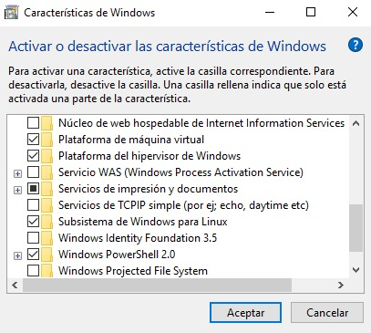
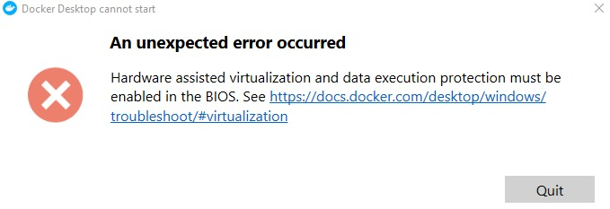
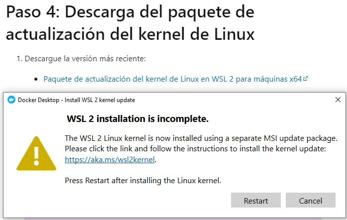
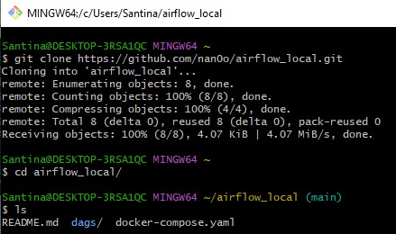

# airflow_local
- Este proyecto tiene como objetivo levantar una instancia
 de Airflow de forma local de la forma más rápida y sencilla
 para usuarios de Windows

## Instalar Docker for Desktop

- Ingresar al [Siguiente Link](https://docs.docker.com/desktop/windows/install/)
y seleccionar el cartel azul **Docker Desktop for Windows**

- Hay que comprobar que esté activado en **Características de Windows** la opción de
**Plataforma de máquina virtual** y **Subsistema de Windows para Linux**
  - No es necesario tener plataforma del hipervisor de Windows activado



- En caso que salga (hardware problem) se debe reiniciar la computadora,
entrar a la BIOS y activar Hardware assisted virtualization. Si tienen la PC en español
esta opción se llama de forma diferente, generalmente se identifica con la palabra "virtualización"
y podemos ver que dice Desactivado. En una laptop HP yo tuve que apretar F10.



- En caso de que Docker Desktop tire el error de WSL 2 installation is incomplete, descargar del [Siguiente link](https://aka.ms/wsl2kernel)
la actualización del kernel para el subsistema de Linux y reiniciar el sistema.




## Ejecutar los comandos dentro del directorio del proyecto

Clonar el repositorio y abrir la carpeta *airflow_local*
en su editor de texto preferido (Yo utilizo Visual Studio Code)



Correr el siguiente comando para inicializar la base de datos
```bash
docker-compose up airflow-init
```

Al finalizar el comando, se deberían identificar las siguientes líneas
```
airflow-init_1       | Upgrades done
airflow-init_1       | Admin user airflow created
airflow-init_1       | 2.2.5
start_airflow-init_1 exited with code 0
```

Para levantar el servicio, simplemente ejecutar
```
docker-compose up
```
Esperar a que se levanten los servicios e ingresar a la web en http://localhost:8080 ó http://127.0.0.1:8080